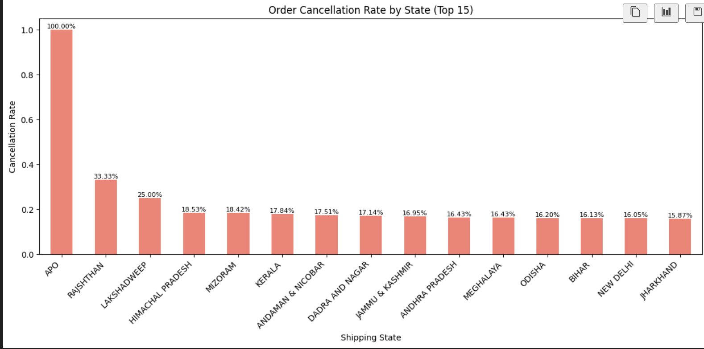
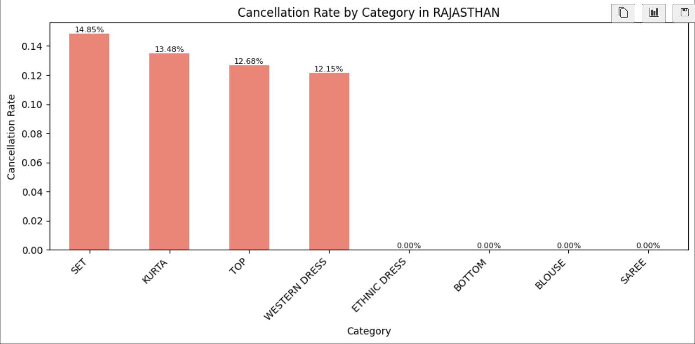
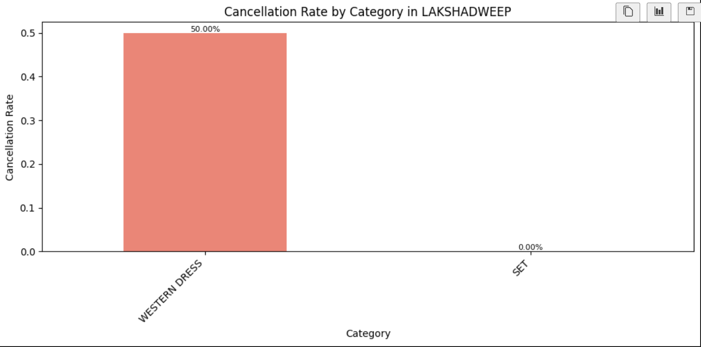
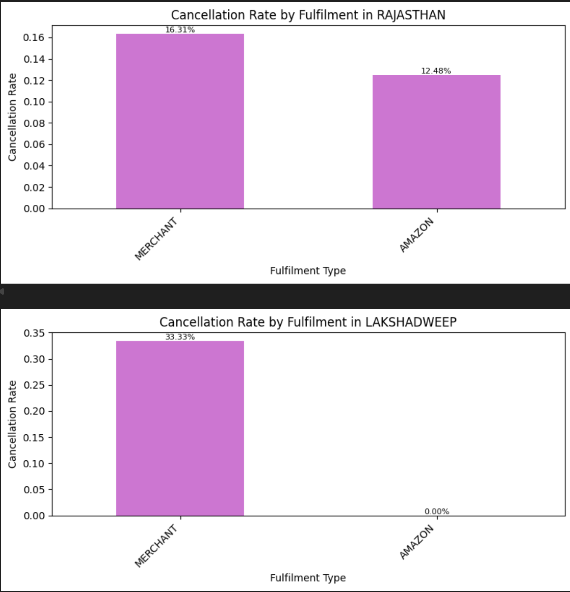
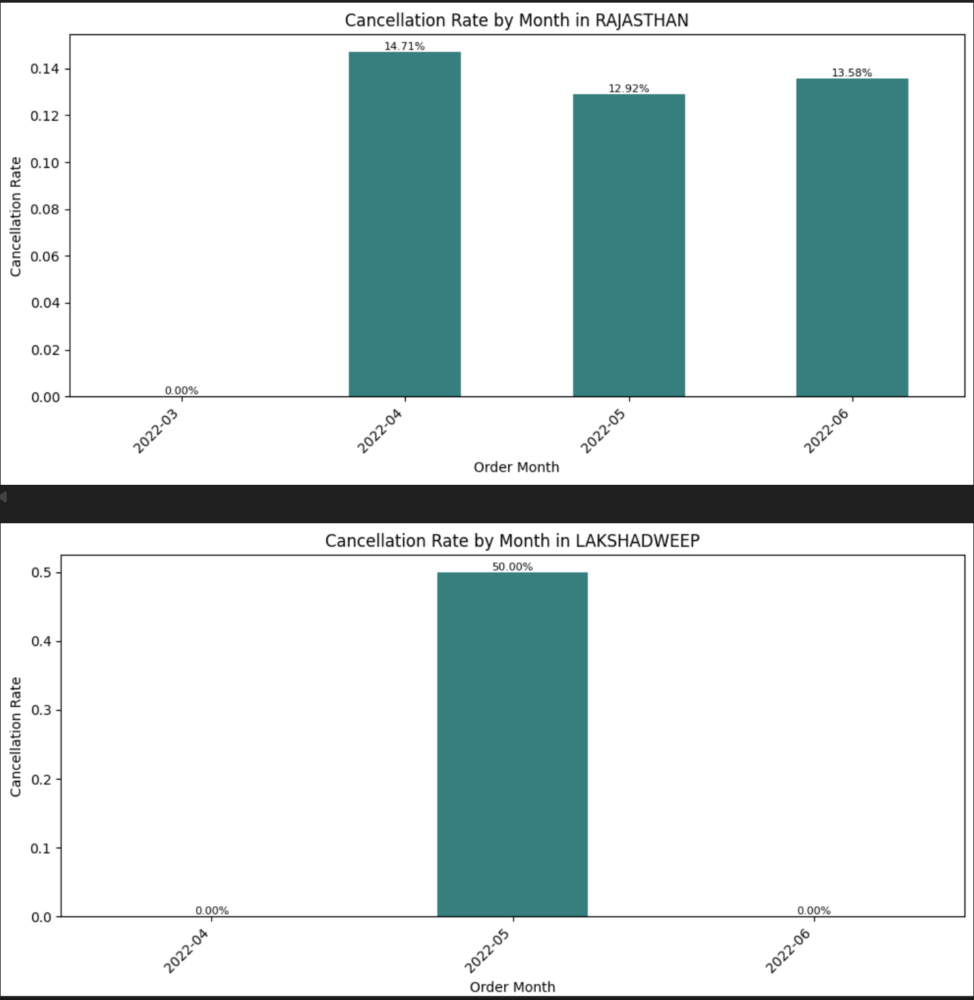
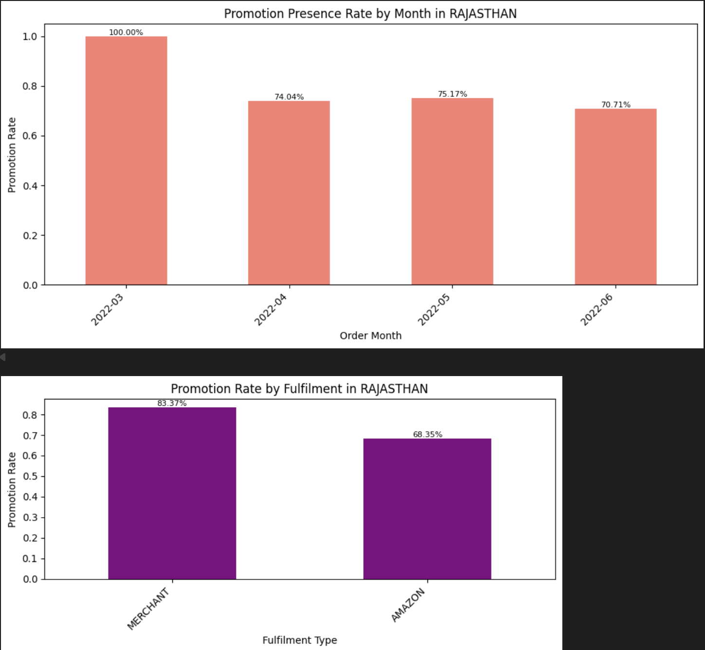
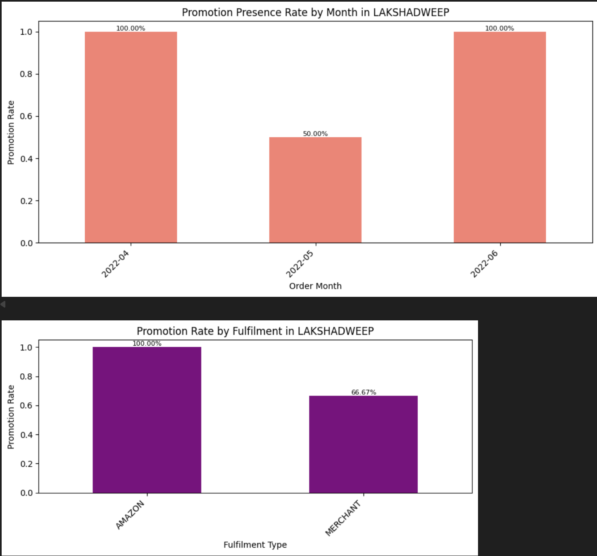
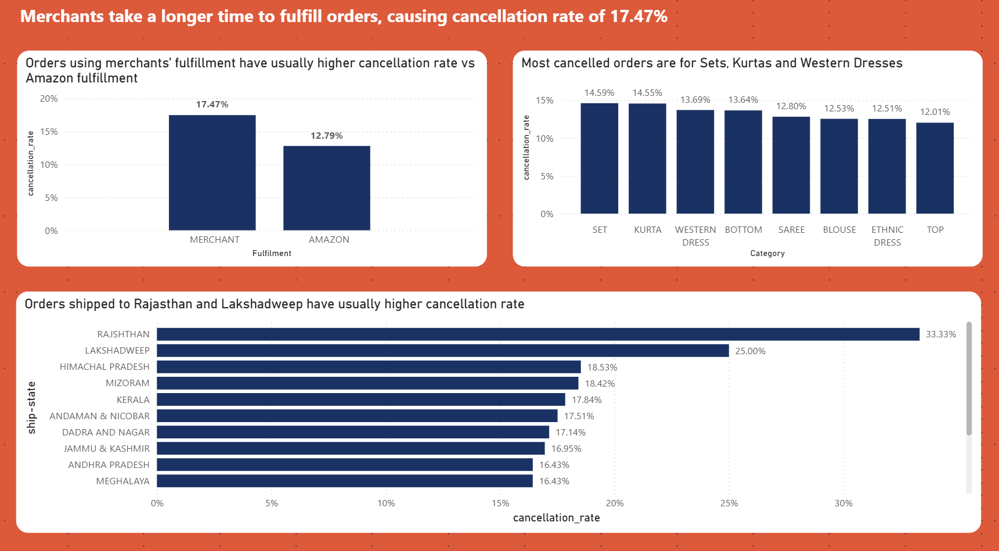

# ShopX
Data Analysis for E-commerce sales

## Business Context
ShopX, a rapidly growing e-commerce marketplace in Southeast Asia similar to Shopee, operates a vast network of third-party sellers and an in-house delivery service, ShopX Express. As of early 2026, the company faces mounting pressure from rising operational costs and intense competition from rising social-commerce platforms. To maintain its market leadership, ShopX is shifting its focus from aggressive expansion to sustainable profitability by optimizing fulfillment efficiency and reducing order cancellations.

## Problem Background
Recent internal audits revealed a significant discrepancy between "Shipped" and "Delivered" statuses, with a high volume of orders being canceled post-payment, particularly in high-density urban areas like Mumbai and Bengaluru. Stakeholders have noted that while the platform achieves a 97% delivery success rate on average, certain categories like "kurta" and "western dress" suffer from higher return and cancellation rates, potentially due to sizing inconsistencies or late fulfillment. This volatility impacts seller confidence and increases reverse logistics costs.

## Stakeholder Request
"We are seeing a trend where nearly 15% of orders are marked as 'Cancelled' despite being processed by merchants. Can you analyze our sales and fulfillment data to identify the primary drivers of cancellations—be it courier performance, regional logistics delays, or specific product category issues—and recommend how we can improve our successful delivery rate?"

## Phase 1: Problem Definition
What is the impact that cleaning and analyzing this data bring to ShopX?
- It should help to tell ShopX how to increase fulfillment efficiency
- It should help to tell ShopX how to reduce order cancellations

Current problems faced by the company are:
- Very high cancellation rate at post payment in areas like Mumbai/Bengaluru
- Certain categories like "kurta", "western" dress suffer higher return and cancellation rates

Consequences faced by ShopX from these problems if they are not solved:
- Impacts seller confidence on marketing their products on the platform and in the long run, reduce the revenue for ShopX
- Increases reverse logistics cost for returns, increasing cost and ultimately reducing profit for ShopX

In conclusion, what we need to find out:
- What is the root cause of the cancellation of orders?
- What are some recommendations to prevent this?

## Phase 2: Data preparation + Cleaning
As I prepared the data for cleaning, I understand that each rows in this dataset represent an order in Amazon India and it provides detailed information such as when the order was made, the order status, the information of the item, the amount and quantity of the order, the city and state the order was shipping to, also any promotions the order was bought under.

Check for duplicate rows:
I first checked for any duplicate rows to remove.

Check data types:
Next, I checked the data type for all the columns to ensure they make sense to the value.

Check null values:
Then, I identified the columns that contain null values for me to clean.

Cleaning process:
I created a copy of the dataset. In this copy, I dropped the columns that do not add value to this analysis, such as columns with only 1 value (eg. currency, ship-country), incomplete data (eg. fulfilled-by) and are just not needed (eg. index, Unnamed: 22).
Afterwhich, for those columns with null values, I fill them with standard values.
Since the courier is the last leg of the delivery journey, if the status is missing, it would mean that the order was cancelled. Therefore I filled the missing values as "Cancelled"
Lastly I ensured values are standard by removing unnecessary spaces and capitalized all values.

Additionally, I added extra aggregate columns that will help me when visualizing these data using Power BI later.

## Phase 3: Data Analysis
From analyzing the data, I saw that the 2 states of Rajasthan and Lakshadweep have unsually higher cancellation rate compared to the other states:

Diving deeper, I can see that the cancelled orders from these 2 states congregate in the Categories of Set, Kurta, Western dress.

Looking at the relationship between the fulfillment and the cancelled orders, I noticed there is a higher rate of orders cancelled which are fulfilled by merchants vs Amazon in the 2 states.

It does seem to point to logistical/fulfillment bottlenecks faced by Merchants that causes higher cancellation rate.

I then looked at the trend of orders cancelled by the month and compared it with the rate of promotions running for each month and noticed merchants are heavily promoting their products even when they are faced with logistical bottlenecks. It does point to merchants setting up promotions to attract customers to buy their products but as they take a longer time to fulfill the orders vs Amazon, the customers start to cancel the orders.

## Phase 4: Data Visualization.
The main analysis is that orders of products mainly Set, Kurta and Western dress, fulfilled by Merchants have high cancellation rate of 17.47%.
The reason for the high cancellation rate is because the Merchants take a long time to fulfill the orders, causing the customers to cancel the orders.

